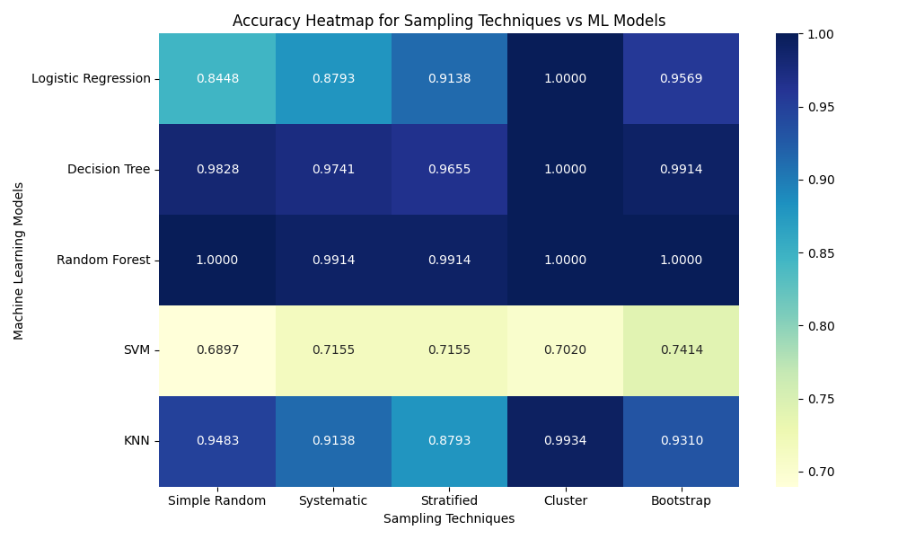

# Assignment-2  Sampling Techniques and Model Performance Analysis

## Objective
The objective of this assignment is to study the importance of sampling techniques in handling highly imbalanced datasets and to analyze how different sampling strategies affect the performance of multiple machine learning models.

This assignment demonstrates how appropriate sampling can significantly influence classification accuracy when dealing with imbalanced real-world data.

---

## Task Category
Supervised Machine Learning – Classification  
(Imbalanced Dataset Handling)

---

## Dataset Used
- Dataset Name: Credit Card Fraud Detection
- File Name: `Creditcard_data.csv`
- Nature of Data: Highly Imbalanced
- Target Variable: `Class`

---

## Experimental Setup
- Platform: Google Colab  
- Programming Language: Python  
- Libraries Used:
  - NumPy
  - Pandas
  - Scikit-learn
  - Imbalanced-learn
  - Matplotlib
  - Seaborn  

---

## Methodology

### Step 1: Handling Class Imbalance
The given dataset contained a severe class imbalance between fraudulent and non-fraudulent transactions.  
To address this issue, **Random Over Sampling** was applied as a preprocessing step to balance the minority and majority classes.

This step ensures that machine learning models receive sufficient examples from both classes before further sampling and training.

---

### Step 2: Sample Size Estimation (Optional)
To maintain experimental consistency, Cochran’s formula was used to estimate an appropriate sample size at a 95% confidence level and a 5% margin of error.

\[
n = \frac{Z^2 \cdot p \cdot (1 - p)}{E^2}
\]

Where:
- Z = 1.96  
- p = 0.5  
- E = 0.05  

Estimated sample size ≈ **385**

> This step was included for experimental reference and is not a mandatory requirement of the assignment.

---

### Step 3: Sampling Techniques
Five different samples were generated from the balanced dataset using the following probabilistic sampling techniques:

- Simple Random Sampling  
- Systematic Sampling  
- Stratified Sampling  
- Cluster Sampling  
- Bootstrap Sampling  

Each technique produced a separate dataset used for model training and evaluation.

---

### Step 4: Machine Learning Models
Each sampled dataset was trained and tested using the following five machine learning models:

- Logistic Regression  
- Decision Tree  
- Random Forest  
- Support Vector Machine (SVM)  
- K-Nearest Neighbors (KNN)  

---

### Step 5: Model Evaluation
All models were evaluated using **classification accuracy**, as specified in the assignment guidelines.  
A total of **25 experiments** were conducted (5 sampling techniques × 5 models).

---

## Results

The table below presents the accuracy obtained by each model under different sampling techniques:

| Model | Simple Random | Systematic | Stratified | Cluster | Bootstrap |
|------|---------------|------------|------------|---------|-----------|
| Logistic Regression | 0.8448 | 0.8793 | 0.9138 | 1.0000 | 0.9569 |
| Decision Tree | 0.9828 | 0.9741 | 0.9655 | 1.0000 | 0.9914 |
| Random Forest | 1.0000 | 0.9914 | 0.9914 | 1.0000 | 1.0000 |
| SVM | 0.6897 | 0.7155 | 0.7155 | 0.7020 | 0.7414 |
| KNN | 0.9483 | 0.9138 | 0.8793 | 0.9934 | 0.9310 |

---

## Results and Analysis
- Random Forest consistently achieved the highest accuracy across almost all sampling techniques.
- Stratified Sampling and Bootstrap Sampling produced stable and reliable performance for most models.
- Cluster Sampling resulted in very high accuracy for certain models due to the homogeneity of selected clusters.
- SVM showed comparatively lower accuracy, which can be attributed to its sensitivity to feature scaling and noise introduced during oversampling.

---

## Visualization
A heatmap was generated to visually compare model accuracy across different sampling techniques.

---

## Conclusion
This assignment demonstrates that sampling techniques play a crucial role in improving machine learning performance on imbalanced datasets.  
Appropriate sampling, combined with suitable models, can significantly enhance classification accuracy.

Random Forest emerged as the most robust model, while stratified and bootstrap sampling techniques provided the most consistent results across models.

---

## Repository Contents
- `sampling_assignment.ipynb` – Complete implementation and experiments  
- `sampling_accuracy_heatmap.png` – Accuracy comparison visualization  
- `README.md` – Project description and methodology  

---

## Tools & Libraries Used
- Python  
- NumPy  
- Pandas  
- Scikit-learn  
- Imbalanced-learn  
- Matplotlib  
- Seaborn  

---

## Author
**Ananya Singh**  
Course: **UCS654**

